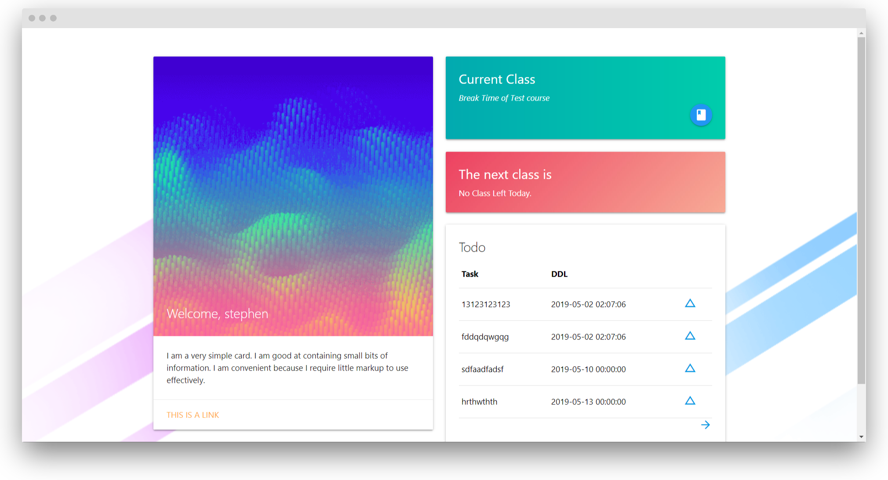
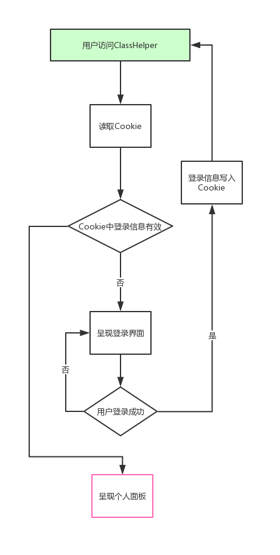

# ClassHelper (暂定名称)

COMPSCI 351课程设计作品, a php-MySQL program.

Stederlee [fsZhuangB](https://github.com/fsZhuangB) Andy

## TODO
1. todo的删除接口
2. 课程的添加、删除
3. 每日一句
4. 个人信息修改
5. 细节修复

## DEMO

A demo page:  http://demo.redets.ga/web/ , login with the following info:
* username = stephen

* passwd = 123456

or simply create your own account.

## Introduction

After studying in University for about two years, we find that the most asked question is:  Which classroom should I go for the next coming class? Usually, we will open curriculum schedule, find the course and its classroom. It takes time and we need to keeping zooming in and out to see it clear. 

Also, we find that a Todo-List is very helpful in our University life, so we won't forget to submit our homework again.

And, as we're majoring in Computer Science, most of our course books are in digital form, which makes us keep searching and searching (because we have tons of files in our disk and they're obviously not managed well).

So, here's why we made ClassHelper. It helps you find the classroom, it helps keeping your Todo-list, also, it helps you with the management of your course books.

In short, ClassHelper is providing you:

- a brief information of the upcoming class
- a todo-list linked with your courses.
- a personal library which store the textbooks you need in the courses.

-Please translate the following parts into English-

## 大体设计的思路

根据我们设计的需求，我们需要实现：

- 前端页面：
  - 登录界面，允许用户登录到自己的面板
  - 用户面板，显示用户的聚合信息
  - PDF在线阅读器，使用其他开源项目完成
  - 通过Cookie储存用户登录的token
- API （如果想要使用其它的语言或开发除了Web端的客户端）
  - 将所有的数据库操作封装为API
- 数据库设计
  - 根据课本的要求完成数据库设计的步骤，**完成文书工作**
  - 建立对应的数据库

## 功能详细介绍

### 用户登录

用户登录逻辑设计如下

（因此我们需要在`index.php`中完成Cookie有效判断和个人面板。在`login.php`中完成登录鉴权和Cookie的操作。）

#### sid 

我们在Cookie中储存一个sid字段。这个字段通过登录API生成，并于用户身份一一对应，并有一定的有效期。

在用户面板呈现时，我们通过查询sid获得对应的用户uid，然后进行对应的数据库查询。

相当于sid作为其它API的一个参数，来确定我们要操作的用户以及用户登录的有效性。

*Please move on with the detailed design of the functions.*

